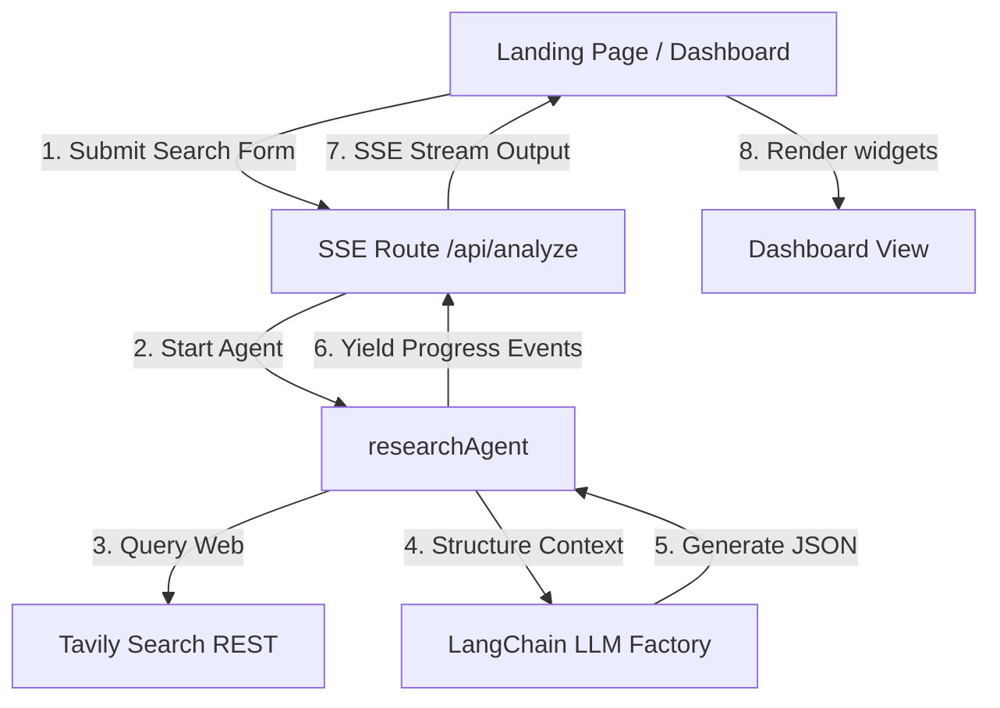

# InvestIQ AI 📈

> **Your Intelligent Investment Research Analyst**

InvestIQ AI is a production-grade, high-fidelity AI-powered Investment Research Agent that compiles institution-grade equity research reports on any company in seconds. It scours the live web using Tavily Search API, performs multi-stage analysis with LangChain.js (supporting Google Gemini 2.5 Flash and OpenAI GPT-4o), streams progress updates in real-time via Server-Sent Events (SSE), and displays a premium, Vercel/Linear-inspired dark dashboard with dynamic Recharts trend graphs.

---

## 📖 Overview

### What the Application Does
InvestIQ AI automates the laborious process of equity research. When a user inputs a company name (e.g., Nvidia, Apple, Reliance, Swiggy), the application launches an automated pipeline that searches the live web, extracts company profiles, parses financial statements, structures competitor maps, reviews SWOT items, evaluates risk matrices, and determines a final **INVEST** or **PASS** decision along with an overall score (0-100).

### The Problem It Solves
Traditional investment research requires hours of scouring news feeds, balance sheets, and SEC filings. Non-financial analysts lack the expertise to isolate operational and market risks or compile SWOT quadrants. InvestIQ AI solves this by aggregating, synthesizing, and formatting complex public market information into a readable, professional report in seconds.

### Why It Is Useful
*   **Instant Synthesis**: Turns raw web clutter into structured, clean insights.
*   **Dual-LLM flexibility**: Swaps backends on the fly to maximize budget or accuracy.
*   **SaaS Grade UI**: Visualizations, caches, and exports ready for use by retail investors, students, or finance enthusiasts.

---

## ⚡ Features

*   **Real-time SSE Progress Streaming**: Server-Sent Events push log steps and checkmark updates to the screen, providing instant loading responses during deep LLM reasoning.
*   **Configurable LLM Provider**: An in-app settings drawer allows toggling between **Google Gemini (Gemini 2.5 Flash)** and **OpenAI (GPT-4o)**.
*   **Robust Live Search**: Leverages **Tavily Search API** to fetch real-time 2025/2026 data.
*   **Demo Mode Fallback**: Automatically activates a simulated web research data generator if no Tavily key is supplied, ensuring the Gemini reasoning engine remains testable immediately.
*   **Interactive Visualizations**:
    *   **AI Investment Score Gauge**: A circular SVG progress indicator animated via Framer Motion that shifts colors from crimson red to emerald green based on rating scores.
    *   **Revenue Growth Trend**: An area chart built with Recharts featuring smooth dual-tone gradients.
*   **Confetti Catalyst**: Triggers a canvas-confetti particle shower when the final decision is **🟢 INVEST**.
*   **LocalStorage Search Cache**: A collapsible drawer storing recent searches for instant, database-free caching and reloading.
*   **Actionable Utilities**:
    *   **Export as PDF**: Print-media CSS stylesheet overrides print layouts, outputting a vector-grade, print-ready document.
    *   **Copy Report**: Compiles and copies the entire investment thesis into a formatted Markdown block for easy sharing.
*   **Zod & React Hook Form Schema Validation**: Validates searches client-side.

---

## 🛠 Tech Stack

*   **Frontend**: Next.js 15+ (App Router), TypeScript, Tailwind CSS v4, Framer Motion, Recharts, Lucide React, Canvas Confetti.
*   **Backend**: Node.js API Route Handlers, Server-Sent Events (SSE) ReadableStream encoders.
*   **AI**: LangChain.js (`@langchain/core`, `@langchain/google-genai`, `@langchain/openai`), Structured Prompts.
*   **APIs**: Tavily Search API.
*   **Deployment**: Optimized for Vercel, Docker, or Node environments.

---

## 📂 Project Structure

```
investiq-ai/
├── src/
│   ├── agents/
│   │   └── researchAgent.ts         # Orchestrates Web Search and LangChain model calls
│   ├── app/
│   │   ├── api/
│   │   │   └── analyze/
│   │   │       └── route.ts         # SSE streaming Route Handler
│   │   ├── globals.css              # Custom styling, print media & animations
│   │   ├── layout.tsx               # Context wrap & global tags
│   │   └── page.tsx                 # Main search hub, settings & landing layout
│   ├── components/
│   │   ├── ui/                      # Textured buttons, cards, inputs, and toast provider
│   │   │   ├── button.tsx
│   │   │   ├── card.tsx
│   │   │   ├── input.tsx
│   │   │   └── toast.tsx
│   │   ├── BusinessModel.tsx
│   │   ├── CompanyOverview.tsx
│   │   ├── CompetitiveAnalysis.tsx
│   │   ├── ExecutiveSummary.tsx
│   │   ├── FinancialSnapshot.tsx
│   │   ├── FinalDecision.tsx
│   │   ├── InvestmentScore.tsx
│   │   ├── LatestNews.tsx
│   │   ├── LoadingScreen.tsx        # Multi-step checklist component
│   │   ├── ResearchDashboard.tsx    # Dashboard layout organizer
│   │   ├── RiskAssessment.tsx
│   │   ├── SearchHistory.tsx        # Sidebar drawer
│   │   └── SourcesList.tsx
│   ├── hooks/
│   │   └── useLocalStorage.ts       # Cache persistence hook
│   ├── lib/
│   │   ├── api-client.ts            # Client-side SSE stream reader
│   │   └── utils.ts                 # Styling utilities (cn)
│   ├── prompts/
│   │   └── analysis.ts              # Strict JSON-enforced prompts
│   ├── services/
│   │   ├── llm.ts                   # LLM client factory
│   │   └── tavily.ts                # RESTful Tavily Search client & Demo fallback
│   └── types/
│       └── index.ts                 # TypeScript type contracts
├── README.md
├── .gitignore
├── .env.example
├── tsconfig.json
├── package.json
└── package-lock.json
```

---

## ⚙️ Environment Variables

A `.env.example` file is included in the project root. Create a local environment file named `.env.local` to configure your keys:

```env
# Tavily Search API Key (Required for live search data)
TAVILY_API_KEY=your_tavily_key_here

# LLM Provider selection: 'gemini' or 'openai' (Default: 'gemini')
LLM_PROVIDER=gemini

# Google Gemini API Key (Required if LLM_PROVIDER=gemini)
GEMINI_API_KEY=your_gemini_key_here

# OpenAI API Key (Required if LLM_PROVIDER=openai)
OPENAI_API_KEY=your_openai_key_here
```

---

## 🔧 Installation & Setup

Follow these steps to run the application locally:

### 1. Clone the Repository
```bash
git clone https://github.com/Peeyush7900/InvestIQ-AI.git
cd InvestIQ-AI
```

### 2. Install Dependencies
```bash
npm install
```

### 3. Setup Environment Keys
Duplicate the `.env.example` file and rename it to `.env.local`:
```bash
cp .env.example .env.local
```
Open `.env.local` and add your Tavily and Gemini/OpenAI API keys.

### 4. Start the Development Server
```bash
npm run dev
```
Open [http://localhost:3000](http://localhost:3000) in your browser.

### 5. Build for Production
To compile type safety and generate an optimized build:
```bash
npm run build
```

---

## 📐 Architecture & System Flow



1.  **ReadableStream Controller**: When the POST request hits `/api/analyze`, the server creates a `ReadableStream`.
2.  **SSE Streaming**: Progress callbacks are translated into SSE chunks (`data: {"type":"progress",...}`) and sent instantly, keeping the UI reactive while LangChain runs.
3.  **JSON Structuring**: LangChain prompts enforce a strict schema. The output is parsed into a clean TypeScript report object and streamed as a `complete` event.

---

## 🧠 How It Works: The AI Workflow

The agentic pipeline executes the following steps sequentially:

1.  **Receive Company Name**: Captures company details through a validated Zod text input.
2.  **Search Web**: Executes a Tavily query. If no Tavily key exists, it invokes a mock data helper providing realistic metrics for the query.
3.  **Collect Financial Information**: Isolates revenues, margins, P/E metrics, and trend history.
4.  **Analyze Company**: Reads and compiles the business model, products, and revenue streams.
5.  **Run SWOT**: Establishes 4 distinct strengths, weaknesses, opportunities, and threats.
6.  **Identify Risks**: Rates operational, financial, market, regulatory, and competitor risks as Low, Medium, or High, and adds reasoning.
7.  **Generate Investment Score**: Ratios the overall company health into a value out of 100.
8.  **Make Recommendation**: Forms a definitive **INVEST** or **PASS** conclusion, details potential upsides/downsides, and specifies the investment horizon.

---

## 💡 Design Decisions

*   **SSE Over Long-polling**: Avoids slow, blocking HTTP requests and timeouts on serverless deployments by streaming events line-by-line.
*   **Browser-Native Vector PDF Export**: Using `@media print` print-styles allows generating vector-grade PDFs directly using the browser's printing layouts, saving backend PDF compute costs.
*   **JSON-Enforced SDK Configuration**: Instantiated `@langchain/google-genai` with `json: true` (which triggers Gemini's native JSON output mode under the hood) and `@langchain/openai` with JSON response formatting, preventing JSON structural breakages.

---

## ⚖️ Trade-offs

*   **Token Consumption**: Generating a comprehensive 20-parameter JSON report uses a moderately high input/output token count per search. We mitigated this by utilizing `gemini-2.5-flash` as the default model, ensuring low costs and fast generation.
*   **Tavily Search API Depth**: To maintain fast turnaround, we capped the search results at 8 entries. If a company is highly obscure, it may return limited datasets, which are handled gracefully with warnings in the dashboard.

---

## 🖼️ Example Runs & Layout Placeholders

### Landing Screen (Idle State)
*   **Visual Elements**: Dynamic animated title gradient, dark backdrop with indigo radial highlights, responsive form, and suggestion badges.
*   *Screenshot Placeholder: `public/screenshots/landing_page.png`*

### Loading Checkmarks Pipeline
*   **Visual Elements**: Animated loading ring, step-by-step checkbox tracker displaying active states in real-time.
*   *Screenshot Placeholder: `public/screenshots/loading_pipeline.png`*

### Investment Dashboard Screen
*   **Visual Elements**: Profile summary card, color-coded score gauge, final recommendation blocks with confetti triggers, SWOT grid, Recharts area growth trend, and news lists.
*   *Screenshot Placeholder: `public/screenshots/dashboard_view.png`*

---

## ⚠️ Challenges Faced

1.  **Gemini Free-Tier Rate Limits**: Stumbled upon `429 Too Many Requests` on `gemini-2.5-pro` free tokens. Solved by transitioning defaults to `gemini-2.5-flash`, which has an ample 15 RPM limit on free credentials.
2.  **JSON Mode Type-Safety**: LLMs occasionally return raw JSON wrapped inside markdown blocks (e.g. ` ```json ... ``` `). Resolved by building a regex-free structural JSON-trimmer inside the agent coordinator before executing `JSON.parse`.

---

## 🔮 Future Improvements

1.  **Real-Time Data Feeds**: Connect EDGAR SEC/Alpha Vantage endpoints to automatically query live ticker pricing rather than web search.
2.  **RAG Document Uploads**: Allow dragging-and-dropping local financial PDFs, merging corporate filing data directly with Tavily results.

---

## 📄 License

This project is licensed under the MIT License - see the LICENSE file for details.

---

## 👤 Author

*   **Peeyush Kumar Yadav**
*   **GitHub**: [Peeyush7900](https://github.com/Peeyush7900)
*   **Repository URL**: [https://github.com/Peeyush7900/InvestIQ-AI](https://github.com/Peeyush7900/InvestIQ-AI)
